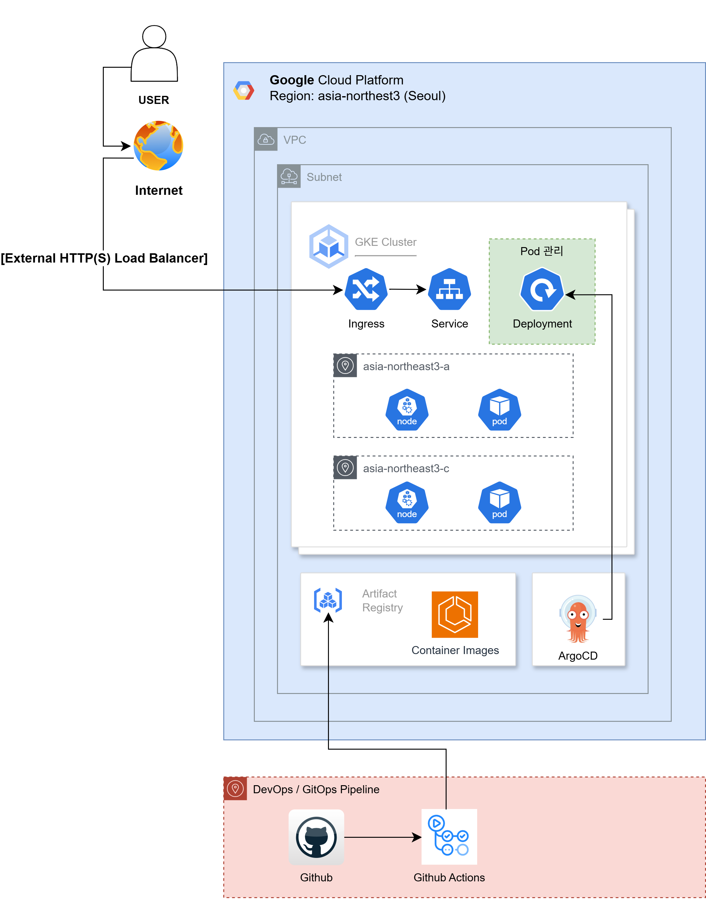
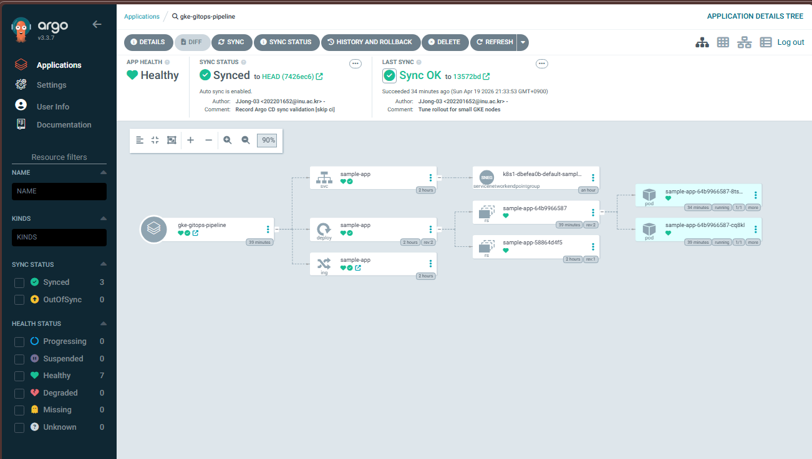
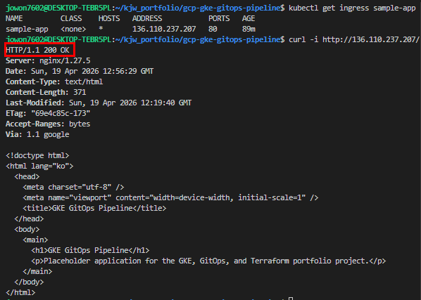
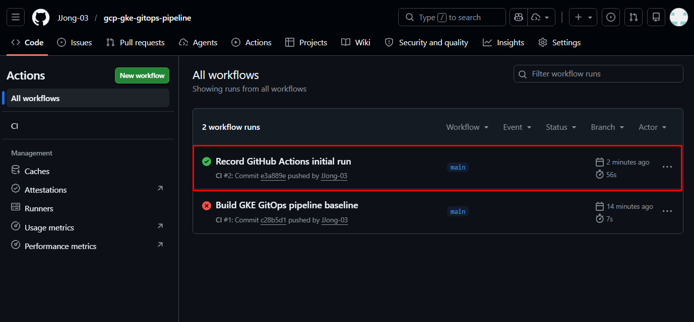
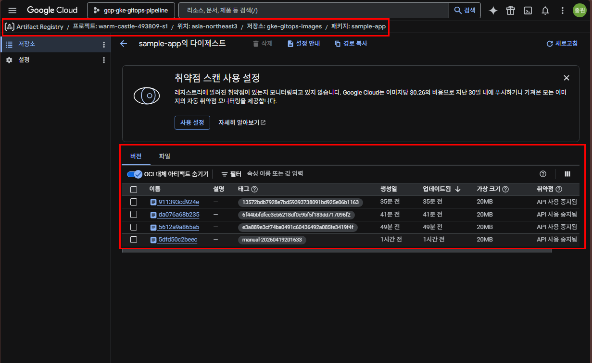

# GCP GKE GitOps Pipeline

<div align="center">
  
  
  
  
  
</div>

> GCP 기반 GKE GitOps 파이프라인을 Terraform으로 구성했습니다.<br/> Artifact Registry, GKE, GitHub Actions OIDC/WIF, Argo CD 기반 배포 흐름을 구현했고, 실제 배포 및 Ingress 접근까지 검증했습니다.<br/> 검증 후 비용 관리를 위해 Terraform destroy로 리소스를 정리했으며, 전체 재현 절차와 트러블슈팅 기록을 문서화했습니다.
<p align="center">
  
</p>

## At A Glance

| 항목 | 내용 |
|---|---|
| 목표 | GCP GKE 기반 CI/CD와 GitOps 흐름을 Terraform, GitHub Actions, Argo CD로 구성 |
| 리전 | `asia-northeast3` |
| Infrastructure | VPC/Subnet, regional GKE, node pool, Artifact Registry, node IAM, GCP API/WIF Terraform definitions |
| CI | GitHub Actions: Docker build, `main` push 시 Artifact Registry push |
| CD | Argo CD: `k8s/` manifest를 GKE에 sync |
| 현재 상태 | Terraform apply, GKE bootstrap, app rollout, Ingress HTTP 200, GitHub Actions image push, Argo CD `Synced/Healthy` 검증 완료. GCP API enablement와 GitHub Actions WIF prerequisite Terraform import 완료, post-import plan `No changes.` 확인 |

## Architecture

```text
User -> GKE Ingress -> Service -> sample-app Pods

Developer -> GitHub Actions -> Artifact Registry
Git repository -> Argo CD -> GKE Cluster
Terraform -> GCP APIs, VPC/Subnet, GKE, Artifact Registry, GitHub Actions WIF prerequisites
```

핵심 설계는 CI와 CD의 책임 분리입니다. GitHub Actions는 이미지를 만들고 Artifact Registry에 push하며, Argo CD는 Git에 기록된 Kubernetes manifest를 클러스터에 동기화합니다.

자세한 구조와 설계 결정은 [Architecture](docs/01-architecture.md)와 [Terraform Plan](docs/03-terraform-plan.md)에 정리했습니다.

## Validated Result

- Terraform `init`, `validate`, `plan`, `apply`
- GKE regional cluster `RUNNING`, node 2개 `Ready`
- GKE node service account IAM과 Artifact Registry pull 권한
- Docker image build/push, GKE image pull, Deployment rollout
- Service NEG annotation, GCE Ingress external IP, HTTP 200 response
- GitHub Actions OIDC/WIF 기반 Artifact Registry image push
- Argo CD Application `Synced/Healthy`

검증 로그는 [Validation](docs/07-validation.md), 문제 해결 과정은 [Troubleshooting](docs/08-troubleshooting.md), 캡처 목록은 [Image Evidence](docs/images/README.md)에서 확인할 수 있습니다.

## Evidence

대표 검증 캡처는 [Image Evidence](docs/images/README.md)에 정리했습니다.

<details>
<summary>대표 검증 캡처 보기</summary>

| Argo CD | Ingress HTTP 200 |
|---|---|
|  |  |

| GitHub Actions | Artifact Registry |
|---|---|
|  |  |

</details>

## Repository Map

| Path | Purpose |
|---|---|
| `terraform/` | GCP API enablement, VPC, GKE, Artifact Registry, GitHub Actions WIF prerequisite modules |
| `k8s/` | Deployment, Service, Ingress desired state |
| `gitops/` | Argo CD Application bootstrap manifest |
| `.github/workflows/` | GitHub Actions image build/push workflow |
| `app/` | Nginx placeholder application |
| `docs/` | architecture, validation, troubleshooting, portfolio notes |

## Reuse Notes

- `k8s/deployment.yaml`은 공개 repo 기준으로 placeholder image URI를 유지합니다.
- 실제 검증에 사용한 image와 결과는 `docs/07-validation.md`와 `docs/images/`에 분리해 기록했습니다.
- `gitops/argocd-app.yaml`의 `repoURL`은 실제 공개 repository URL을 유지합니다. fork하거나 재사용할 때는 본인 repository URL로 교체합니다.
- credential, token, secret 값은 repository에 포함하지 않습니다.

## Documentation

| 문서 | 내용 |
|---|---|
| [Project Overview](docs/00-project-overview.md) | 프로젝트 목적과 범위 |
| [Architecture](docs/01-architecture.md) | GCP/GKE/GitOps 구조와 책임 경계 |
| [Implementation Plan](docs/02-implementation-plan.md) | 단계별 진행 상태 |
| [Terraform Plan](docs/03-terraform-plan.md) | Terraform module boundary와 리소스 설계 |
| [GKE Bootstrap](docs/04-gke-bootstrap.md) | GKE 접속과 기본 점검 |
| [App Deployment](docs/05-app-deployment.md) | Kubernetes 배포와 Ingress 검증 |
| [GitOps CI/CD](docs/06-gitops-cicd.md) | GitHub Actions, WIF, Argo CD 흐름 |
| [Validation](docs/07-validation.md) | 실제 검증 기록 |
| [Troubleshooting](docs/08-troubleshooting.md) | 장애 원인, 해결, 재발 방지 |
| [Portfolio Notes](docs/09-portfolio-notes.md) | 발표/면접용 설명 포인트 |
| [Reproduction Runbook](docs/10-reproduction-runbook.md) | 처음부터 다시 따라 실행하는 절차 |

## Future Improvements

- Terraform remote backend 구성 (GCS, state locking)
- Cloud DNS, static IP, Managed Certificate 기반 HTTPS Ingress
- image tag 자동 반영 전략
- Argo CD AppProject/RBAC hardening
- cleanup 절차 자동화와 비용 추정 보강
